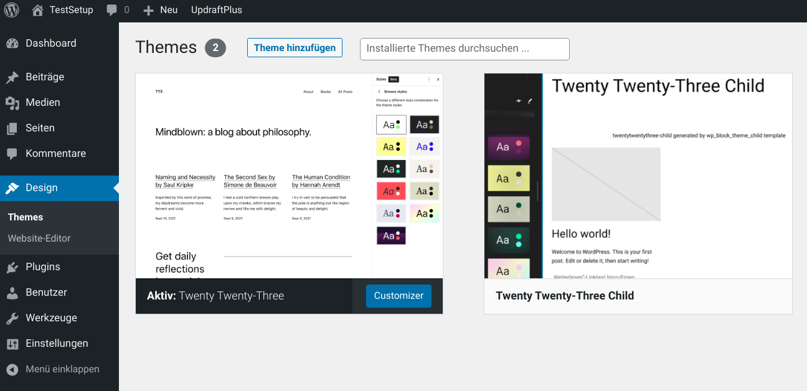

# WordPress Block Theme Child Template

[wp_block_theme_child](https://github.com/openmindculture/wp_block_theme_child) is a local host WordPress setup using Docker, docker-compose, and wp-cli
to install themes and plugins, including a simple template skeleton for a Twenty-something child
theme using the template engine (`theme.json`), block editor and full-site editing.

## TODO / Work in Progress

This is an unfinished stub, based on `wp_cli_docker` (see below). Ideas and learning takeaways from other (open source) projects should be ported back to and collected in this repository.

## White Label / Template Customization

### zip and ship

There is **no build step**, unless you need custom blocks, you can zip and ship the theme folder as it is. This also means that you cannot use SCSS, TypeScript, or any other experimental synatx that is not widely supported by major browsers (see MDN or caniuse if in doubt).

### fork or add Upstream

To use this repository as a template for a new WordPress theme, fork it on GitHub or set it as a remote upstream of an existing project. Modify the `twentytwentyfive-child` theme according to your (customers') requirements.

### WP child theme with custom title

You can change the display name and screenshot to make the theme appear as an individual customer theme, while the technical name (textdomain) stays twentytwentyfive-child making it a child theme of the official WordPress theme Twenty Twenty-Five.

### multiple inheritance, sort of

Effectively, you will have two upstreams providing you with updates: twentytwentyfive (at run time via WordPress updates) and this template respository, `wp_block_theme_child`, only when you chose to check and pull updates into your forked/downstream version.

### minimalism and best practices

Adhere to WordPress best practices, apply minimal changes and prefer content and configuration over modification to avoid conflicting side effects of any future update!

## Repository Usage

### Initial Setup

Edit localhost ports and initial plugins in `install-local-environment.js` and `docker-compose.yml`,
then run `npm install` and open http://localhost:8025/wp-admin (replace `8025` with the configured port) in your browser.
Log in with the default demo credentials (user: `admin`, password: `secret`).

The following directories are mounted below the project root directory by default:

- plugins
- themes
  - themes/twentytwentythree-child
- wp_data

They are set to be ignored in `.gitignore`, except for `themes/twentytwentythree-child`.

Check an edit your IDE settings to exclude or exclude these directories for search / indexing. Edit write permissions
if necessary before editing the child theme, e.g.

```
sudo chown -R your_username:your_group themes
sudo chmod -R ug+rw themes
```

Likewise, we might have to explicitly allow uploads by clients:

`sudo chmod -R ugo+rwx wp_data/uploads`

### Start, Stop, Destroy

- `npm start` (re)starts the local WordPress server
- `npm stop` will retain local data after stopping
- `npm run destroy` stops and removes local data

## Customization

- functions.php
- screenshot.png
- style.css
- theme.json

optionally:
- custom assets (fonts, images)
- custom scripts
- custom blocks, block variations, or template parts

## Further Reading, Alternatives, and Known Issues

### References

#### theme.json Reference (WordPress.org)

https://developer.wordpress.org/block-editor/how-to-guides/themes/theme-json/

#### theme.json Font Definition

https://fullsiteediting.com/lessons/theme-json-typography-options/#using-the-web-fonts-api-with-theme-json

TODO: check for updated possibilities and best practices like WP font API

#### full site editing child themes

https://fullsiteediting.com/lessons/child-themes/

### Origin and Alternatives

This respository was based on a fork of [wp_cli_docker](https://github.com/openmindculture/wp_cli_docker) and follows the opposite direction of the classic / hybrid
[wp_template_opinionated](https://github.com/openmindculture/wp_template_opinionated) theme template.

### Issues

The child template is an incomplete stub including references to non-existing assset files in
`themes/twentytwentythree-child/theme.json`. The theme needs to be edited and verified!

The installation script has been conceived to work anywhere, but it has actually been tested and used mostly on Ubuntu Linux. There have been configuration and performance issues especially on slow Windows WSL Docker systems.



## Requirements

- npm
- Docker (incl. Docker compose)

## Development Setup Configuration

### Configure pre-installed Themes and Plugins

Modify [install-local-environment.js](./install-local-environment.js) to select which themes and plugins will be installed automatically using `wp-cli`.
You must specify the technical names (text domains), not the current titles! The technical names are the same as the
directory names in the plugin paths.

```js
/* specify the technical names (text domain) of plugins to be installed */
'wp plugin install --activate incompatibility-status';
```

Some commercial / paid plugins cannot be installed automatically. They have to be uploaded or installed manually later.

### Configure WordPress Core, Web Server, PHP Version used

Modify [docker/WordPress.Dockerfile](./docker/WordPress.Dockerfile) to choose one of various predefined configurations using different PHP versions
like 7.4, 8.0, 8.1 etc. and popular web servers like Apache or nginx to copy our customer's web hosting provider's
technical setup as good as possible.

See https://hub.docker.com/_/wordpress/ for available docker tags, or keep `wordpress:latest` for the newest (latest) stable release.

```Dockerfile
FROM wordpress:latest
# use other tags in docker/wordpress.Dockerfile to test specific versions, see
# https://hub.docker.com/_/wordpress/
# FROM wordpress:6.1.1-php8.0-apache
```

### Technical Notes

The `copyfiles` module causes a warning about its `inflight` dependency which is officially deprecated due to an alleged memory leak. However, for a small project like this with less than a hundred files in total in a handful of directories nested no deeper than three levels, the severity is likely minimal or negligible.